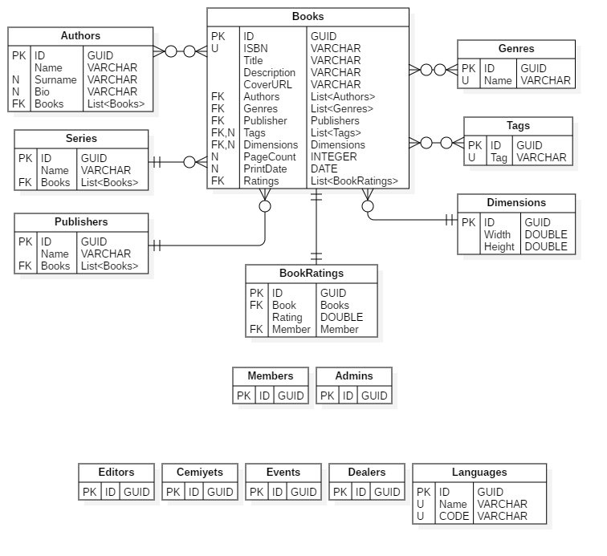

## Glossary

| Symbol | Meaning |
|:-:|--|
| ❓ | it's not accepted yet |
| 💶 | potential income model |
| 🆘 | help needed |

---

## Actors

| Actor | Assets |
|--|--|
| 👻 **Guest** | nothing. |
| 👤 **Member** | *book lists* |
| 👤 **Author** | *books*, *followers*, *events* ❓, *publishers* ❓ |
| 👥 **Publisher** 💶 | *books*, *authors*, *followers*, *events* ❓ |
| 👥 **Dealer** 💶❓ | *book links* |
| 👥 **Editor** | *change records* ❓ |
| 👥 **Admin** | *change records* ❓ |

**Actor Authorities**

| Actor | Authorities |
|--|--|
| 👥 **Dealer** 💶❓ | edit links to books |
| 👥 **Publisher** 💶 | edit books, book series, authors, events ❓ |
| 👥 **Editor** | edit particular books (by genre, by author) |
| 👥 **Admin** | edit all kind of data and manage editors |

---

## Requirements

| As a/an | I want to... | So that... | Notes | Priority | Status |
|--|--|--|--|--|--|
| 👻 **Guest** |   |   |   |   | TODO |
|   |   |   |   |   |   |
| 👤 **Member** |   |   |   |   | TODO |
|   |   |   |   |   |   |
| 👥 **Editor** |   |   |   |   | TODO |
|   |   |   |   |   |   |
| 👥 **Admin** |   |   |   |   | TODO |
|   |   |   |   |   |   |
| 👤 **Author** |   |   |   |   | TODO |
|   |   |   |   |   |   |
| 👥 **Publisher** |   |   |   |   | TODO |
|   |   |   |   |   |   |
| 👥 **Dealer** |   |   |   |   | TODO |
|   |   |   |   |   | TODO |

---

## Models

- Books
- Genres
- Series
- Members
- Editors
- Admins
- Authors
- Publishers
- Tags ❓
- Events ❓
- Dealers ❓
- Cemiyets ❓
- Translators ❓
- Languages ❓
- Ratings ❓

## Entity-Relationship Diagram

Status: Work-in-progress.

---
